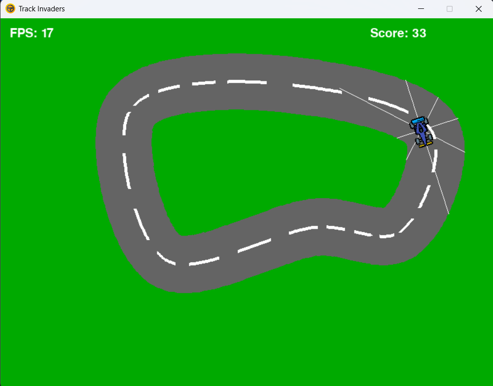

# Reinforcement Learning Car Game

A Python-based car game that implements various reinforcement learning algorithms to enable autonomous driving. The project demonstrates three different machine learning techniques:

1. Deep Q-Learning (DQN)
2. NeuroEvolution of Augmenting Topologies (NEAT)
3. XGBoost with Keras


## Features

- **Autonomous Driving**: Self-learning car using three different AI techniques
- **Customizable Tracks**: Design and modify tracks to test learning adaptability
- **Performance Metrics**: Monitor learning progress and performance

## Project Structure

The project is organized into four main folders:

### 1. Main_Game

- Basic game environment for testing and player interaction
- Serves as the foundation for all AI implementations

### 2. DQN

- Implementation of Dueling Deep Q-Network
- Features actor-critic model architecture
- Includes extensive replay buffer system

### 3. NEAT_Agent2

- NEAT algorithm implementation
- View results through agent mode in main menu

### 4. XGBoost_Agent3

- XGBoost implementation with Keras
- Includes training mode for data generation
- Allows user gameplay for model training

## Installation

1. Clone the repository:

```bash
git clone https://github.com/Artist06/ReinforcementLearning_Car_Game.git
cd ReinforcementLearning_Car_Game
```

2. Create a Python environment (recommended):

Option A: Using Anaconda

```bash
conda create -p venv python==3.12
conda activate ./venv
```

Option B: Using venv

```bash
python -m venv env_name
env_name\Scripts\activate
```

3. Navigate to desired implementation:

```bash
cd <folder_name>  # Main_Game, DQN, NEAT_Agent2, or XGBoost_Agent3
```

4. Install dependencies:

```bash
pip install -r requirements.txt
```

5. Run the game:

```bash
python main.py
```

## Controls

- **Agent Mode**: AI operates autonomously using sensor inputs
- **Player Mode**: Use arrow keys for manual control

## Screenshots

### Main Menu


### Rules Page


### Agent in Action


